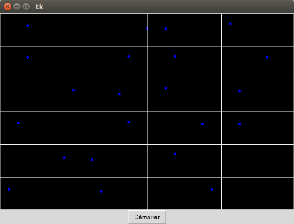

# Feuille d’exercices n∘2
Les 2 exercices sont à faire dans l’ordre. Certaines questions vous demandent d’écrire des fonctions. Celles-ci doivent être utilisées dès que c’est possible. Pour certaines questions il faut prendre l’initiative d’écrire une fonction même si cela n’est pas explicitement demandé. Pensez à écrire une docstring pour chaque fonction qui décrit ce que sont les entrées et sorties (s’il y en a) et ce que fait la fonction.

## Exercice 1

1. Votre fenêtre graphique doit contenir un canevas de couleur de fond noire et de taille 600x400 ainsi qu’un bouton avec le texte “Démarrer” placé en dessous du canevas. 

2. Ecrire une fonction

    def creer_balle() qui

    dessine un cercle rempli de bleu au milieu du canevas de rayon 20 pixels;
    retourne une liste contenant l’identifiant de la balle créée suivi de deux entiers choisis au hasard entre 1 et 7; cette liste sera appelée “balle” dans la suite;
    puis créer une balle en appelant cette fonction dans la partie principale du programme, et la sauvegarder dans une variable.

3. Ecrire une fonction
def mouvement(balle) 
qui prend en entrée une balle et qui la déplace de balle[1] pixels horizontalement, et de balle[2] pixels verticalement.

4. Ajouter le code qui fait que quand l’utilisateur clic sur le bouton “Démarrer” alors la balle se déplace de balle[1] pixels horizontalement, et de balle[2] pixels verticalement.

5. En utilisant la méthode .after(), faire en sorte que le déplacement se poursuive sans avoir besoin de re-cliquer sur le bouton.

6. Faire en sorte que lorsque l’on clique sur le bouton “Démarrer”, alors son texte change et devienne “Arrêter”, et que, quand on clique sur le bouton “Arrêter”, la balle s’arrête et le bouton se renomme “Démarrer”, et ainsi de suite.

7. Ecrire une fonction
def rebond1(balle) 
qui prend en argument une balle et qui la modifie pour qu’elle rebondisse sur les bords du canevas. Utiliser ensuite cette fonction dans la fonction mouvement() pour que le rebond soit effectué.

8. Ecrire une fonction
def rebond2(balle) 
qui prend en argument une balle et qui la modifie pour qu’elle ait le comportement suivant: quand la balle sort en bas (resp. gauche, droite, haut) elle ré-apparaît en haut (resp. droite, gauche, bas). Remplacer l’appel à la fonction rebond1() par rebond2() pour tester votre fonction.

## Exercice 2

Cet exercie est la suite de l’exercice 1. Il faut copier le programme de l’exercice 1 dans un nouveau fichier. L’objectif est d’obtenir la figure suivante où chaque balle se déplace à l’intérieur de son carré en rebondissant sur les bords (fonction rebond1()).

1. Ecrire une fonction

    def creer_rectangle(x0, y0, x1, y1) 
    qui

    * créé un rectangle blanc dont les coins opposés sont aux coordonnées (x0, y0) et (x1,y1) (on supposera que x0 < x1 et y0 < y1),

    * créé une balle au centre dont le diamètre est le dizième de la plus petite dimension du rectangle (utiliser la fonction creer_balle() en l’adaptant)

    * retourne la liste obtenue par la création de la balle suivie des coordonnées du rectangle créé [x0, y0, x1, y1], le tout mis dans une liste; dans la suite ce type de variable est appelé “rectangle”.

2. Adapter le programme pour qu’il tienne compte du changement de la variable de type balle à la variable de type rectangle. En particulier, il faut adapter toutes les fonctions qui manipulent des variables de type balle. Tester le programme sur un rectangle créé au milieu du canevas.

3. Ecrire une fonction
def quadrillage(n, m) 
qui découpe le canevas en un quadrillage de n colonnes et m lignes constituées de rectangles contenant des balles qui se déplacent (cf l’exemple de la figure avec n=4 et m=6). La fonction retourne la liste de tous les rectangles qui ont été créés.

4. Compléter le programme pour que toutes les balles du quadrillage se déplacent en rebondissant à l’intérieur de leur rectangle.